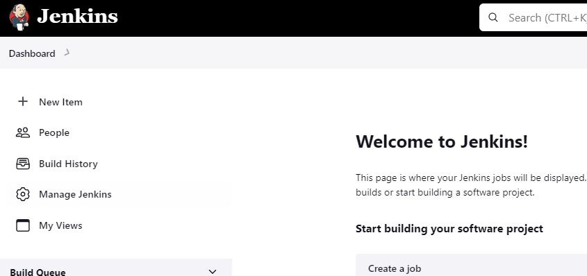

今天我们将演示，在 Jenkins 运行你的第一个项目（Item，也被称为 Job），通过 shell 命令，在 Jenkins 中输出 “Hello World!”

<!--more-->

我们只演示前两种 Freestyle Project 和 Pipeline.

在开始之前，我们首先来看一下 Jenkins 的项目（Item）类型：
    Freestyle Project
        Jenkins 核心功能，Jenkins 将和任何 SCM 系统，任何 build 系统结合构建你的项目。同时它还可以用于软件构建除外的其他事情。
    Pipeline
        构建 Pipeline（工作流）
    Multi-configuration project
        需要大量不同配置的项目，如，在多个环境中进行测试，构建等等
    Folder
        存储嵌套 item 的容器，用于对它们进行分组
    Multibranch Pipeline
        根据 SCM 仓库中检测到的分支创建一组 pipeline 项目
    Organization folders
        通过扫描仓库来创建一组多分支项目的子文件夹

### Freestyle Project

通过浏览器打开 Jenkins 页面并登录，点击左边的 “New Item” 选项，创建一个新的 Item。


在 Enter an item name 文本框中输入 item 名称，如，first_project。在 item 类型，选择 “Freestyle Project”。


在 Configuration 页面，我们可以配置（具体看到的内容，和你安装了那些插件有关，很多选项都是由相关插件提供的）：
    General：该标签包含需要创建项目的基本信息，如，描述信息（Description）
    Source Code Management：在该标签页面中，你可以进行版本控制系统相关的配置，如，git，
    Build Triggers：配置触发 Build 作业的触发器。可用的触发器有：
        Trigger builds remotely (e.g., from scripts)
        Build after other projects are built
        Build periodically
        GitHub hook trigger for GITScm polling
        Poll SCM
            定期轮询代码仓库
                1 * * * *
                H/15 * * * *
    Build Environment：Build 环境相关相关的配置，对于不同的语言，安装的插件不一样，这里的配置选项也不一样
    Build Steps：指定 Build 的方式以及步骤。如，我们可以选择 Execute Shell 的方式进行 Build，通过 shell 命令指定 Build 的具体步骤
    Post-Build Action：Build 完成后，运行的任务或操作。如，Build 完成后，清理 workspace，删除生成的文件，发送一封邮件通知 build 结果，等等。


在这里，我们直接跳到 Build Steps 并选择 “Add build step" 添加一个 build step，我这里选择的是 "Execute shell"。


在 Command 文本框中输入：
```shell
echo "Hello World!"
```

然后点击 Save 保存。


在项目（first_project）页面，点击 Build Now 进行 Build。你可以在下面 Build History 看到 build 的结果。我们可以点击该 Build 查看更多的信息。Build 是通过 # 加数字命名的，每 Build 一次，数字加 1，初始值为 1.


点击 Console Output，可以看到 build 过程中的输出，看到 “Hello World!” 已经被输出，并且 Finished 的状态是 SUCCESS。


### Pipeline Project

开始和创建 Freestyle Project 没什么区别，点击左边的 New Item, 然后在 Enter an item name 文本框中输入 item 名称，如，first_project_pipeline。在 item 类型，选择 “pipeline”。


在 Configuration 页面的 Pipeline 下面的 Definition 下选择 Pipeline script。并在 Script 文本框中定义 Pipeline script。然后点击 Save 进行保存。

```shell
pipeline {
    agent any 
    stages {
        stage('Stage 1') {
            steps {
                sh 'echo Hello world!' 
            }
        }
        stage('Stage 2') {
            steps {
                sh 'echo I am Aaron.' 
            }
        }
    }
}
```


我们将 Pipeline script 称为 Jenkinsfile。它和 Dockerfile 一样，拥有自己的语法格式。目前我们只需要知道这个脚本会按顺序（步骤，step）执行两个命令 “echo 'Hello world!'” 和 “echo 'I am Aaron.'”。后面我们会讲解 Jenkinsfile 的语法格式。


然后在 Project 页面，选择 Build Now 进行 Build。在 Build History 点击该次 Build。


点击 Console Output，可以看到 build 过程中的输出，看到 “Hello World!” 和 “I am Aaron.” 都已经被输出，并且 Finished 的状态是 SUCCESS。

