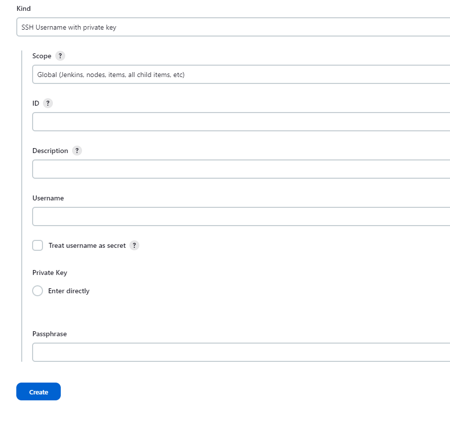

今天我们来看看怎么在 Jenkinsfile 中使用凭据。

<!--more-->

在 Jenkins 中，支持多种凭据，一般常用的的有：
- Username and password：用户名和密码
- Github APP：通过 GitHub 应用程序验证
- Secret text：token 的方式
- Secret file：加密的文件
- SSH Username with private key：秘钥的方式
- Certificate - 使用 PKCS#12 证书文件

在这里，我们只讲解两种我们常用的凭据：Username and password 和 SSH Username with private key。

首先我们来看看 Username and password
登录到 Jenkins，点击 Manage Jenkins > Credentials, 然后点击 Stores scoped to Jenkins 下的 System（基于安装方式，这里显示的内容可能不一样。）


然后点击 System 下的 Global credentials(unrestricted) domain，我们将凭据添加到该 domain 下。默认就这一个 domain，如果你想添加 domain，你可以点击右上角的 Add domain 来添加。


点击右上角的 Add Credentials 按钮，添加一个凭据。


填写下面信息，然后点击 Create 按钮创建凭据。
- Kind：Username with password
- Scope：Global（Jenkins, nodes, items, all child items，etc)
- Username：root
- Password：P@ssw0rd
- ID：remotehost（如果不填，系统会自动指定一个很长的 ID，作为用户 ID）
- Description（可选）：用户命的描述信息，可以不填


创建一个新的 pipeline 项目，并在 Pipeline Script 文本框中粘贴下面内容，并 Build。
```bash
pipeline {
    agent any
    stages {
        stage('echo') {
            steps {
                withCredentials([usernamePassword(credentialsId: 'ssh_remote', usernameVariable: 'USERNAME', passwordVariable: 'PASSWORD')]){
                    sh 'echo the username is ${USERNAME} and the password is ${PASSWORD}'
                }
            }
        }
    }
}
```


Build 完成后，点击当前的 Build ID，在 Console Output 中查看当前的 Build 输出。密码字段是以 ***** 的方式暂时的，但这个并不影响我们使用这个凭据。

接下来我们来看看 SSH Username with private key。

在创建私钥之前，我们需要在 Jenkins 上生成秘钥对。我们后面的演示，是通过私钥进行 ssh 连接到远程主机，运行一个 shell 命令，所以我们需要指定秘钥的格式，使用 RSA 的格式，因此，我们需要在 Jenkins 服务器上运行下面命令来生成秘钥对：
```bash
ssh-keygen -m PEM -t rsa -b 4096
```

然后使用 ssh-copy-id 命令将公钥传输到远程主机。


创建方式与前面一样，不同的地址在于，创建凭据时的 Kind 的选项，前面我们选择的是 Username with password，现在我们要选择 SSH Username with private key。具体的选项内容：
- Kind：SSH Username with private key
- Scope：Global（Jenkins, nodes, items, all child items，etc)
- ID：remotehost（如果不填，系统会自动指定一个很长的 ID，作为用户 ID）
- Description（可选）：用户命的描述信息，可以不填
- Username：凭据对应的用户名（默认为 root）
- Private Key：配置私钥，在这里选择 Enter Directly，然后点击下面（右下）的 Add 按钮，调出文本输入框，并粘贴前面生成的私钥中的内容到该文本框中。

然后点击 Create 按钮，创建凭据。



创建一个新的 pipeline 项目，并在 Pipeline Script 文本框中粘贴下面内容，并 Build。
```bash
pipeline {
    agent any
    stages {
        stage('echo hostname') {
            steps {
                withCredentials(bindings: [sshUserPrivateKey(credentialsId: 'remotehost', keyFileVariable: 'identity', usernameVariable: 'USERNAME')]) {
                    script {
                        sh 'ssh -i $identity $USERNAME@192.168.31.24 hostname'
                    }
                }
            }
        }
    }
}
```


Build 完成后，点击当前的 Build ID，在 Console Output 中查看当前的 Build 输出。远程主机名被正确输出。


更多关于凭据的使用，可以参考：
https://www.jenkins.io/doc/book/pipeline/jenkinsfile/#handling-credentials

https://www.jenkins.io/doc/book/using/using-credentials/
