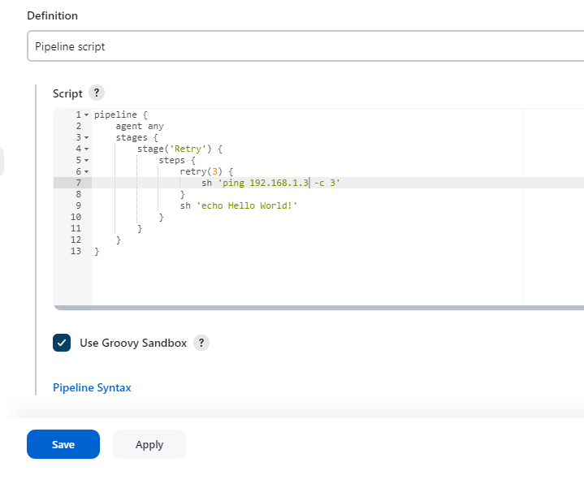
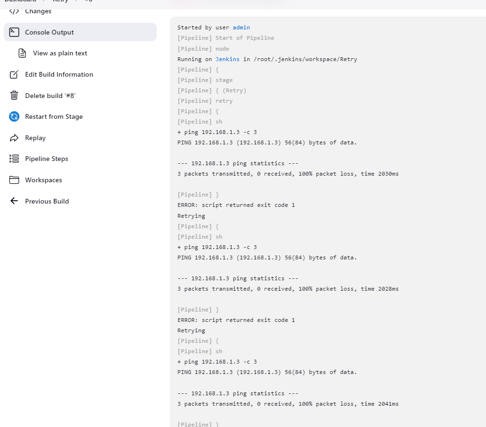
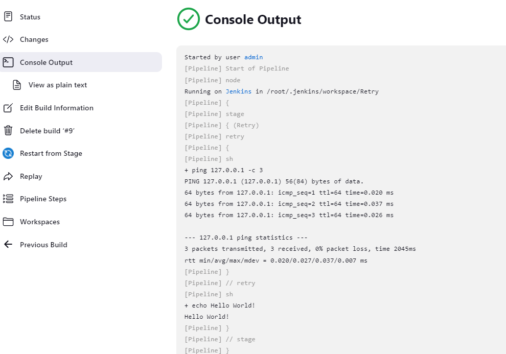
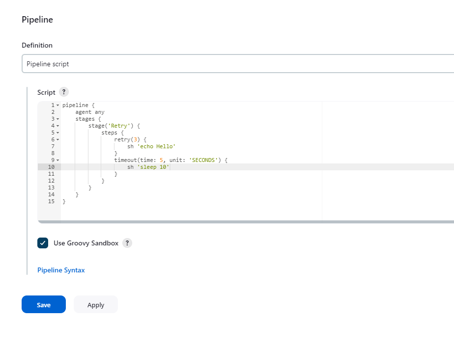
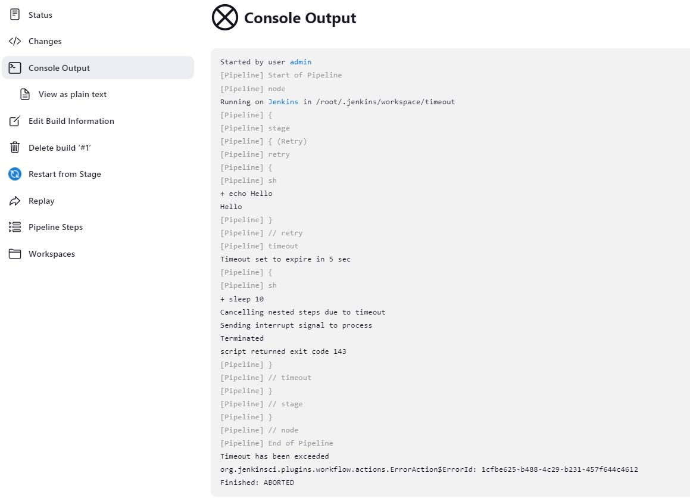

在实际的 pipeline 脚本中，我们会遇到一些偶然性的问题，特别是和网络相关的，如，下载某些软件包，或者在 git 仓库时，可能会因为网络的抖动，而引起下载失败，此时我们就需要使用 retry，进行重试。

<!--more-->

我们可以通过 retry(n) 来指定需要重试的指令，n 表示重试的次数。在我们示例中，只有 ping 3 次失败了，才认为失败。保存该 pipeline，并 build（192.168.1.3 是一个 ping 不到的地址）。
```bash
pipeline {
    agent any
    stages {
        stage('Retry') {
            steps {
                retry(3) {
                    sh 'ping 192.168.1.3 -c 3'
                }
                sh 'echo Hello World!'
            }
        }
    }
}
```


我们可以通过 Build History 查看 build 的结是失败的。查看具体的输出，我们发现了 ping 命令执行了 3 次，并且 3 次都失败了。


如果是在 Container 中运行的 Jenkins，需要确保 container 中包含 ping 命令，不然重试三次的错误和我这里的会不一样。

修改 pipeline，将 ping 的 IP 换成一个可以 ping 的，如 127.0.0.1，再次 build。发现 ping 命令只执行了一次。


顺便在说一下 timeout，它常用于一些存在延迟的情况。在某些特定的场景下，可以和 retry 混用。如，发送服务启动指令后，检查服务的状态，我们可以设置一个超时时间，在这个时间之后，如果服务还没起来，则认为服务启动失败。但我们也可以用 retry，检测到服务失败后，进行重试，在重试了指定次数之后，如果依然失败，则认为服务失败。
```bash
pipeline {
    agent any
    stages {
        stage('Retry') {
            steps {
                retry(3) {
                    sh 'echo Hello'
                }    
                timeout(time: 5, unit: 'SECONDS') {
                    sh 'sleep 10'
                }
            }
        }
    }
}
```



查看 build 结果，发现有提示，由于超时，发送中断信号（interrupt signal）终止程序。



