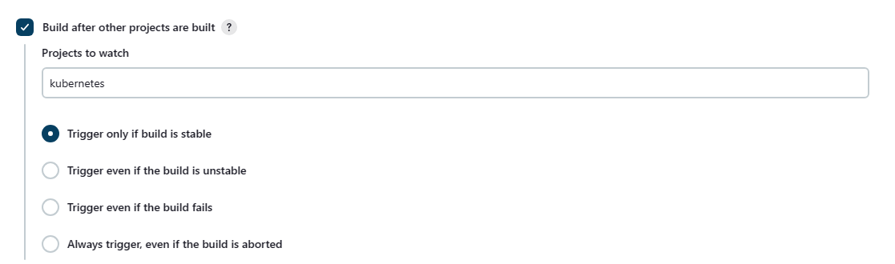
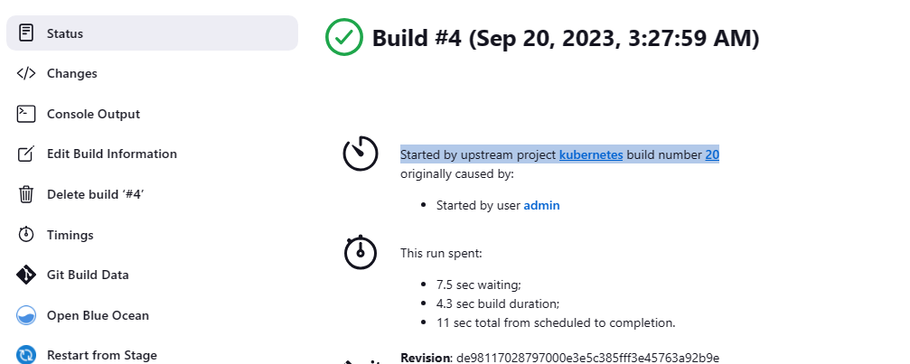
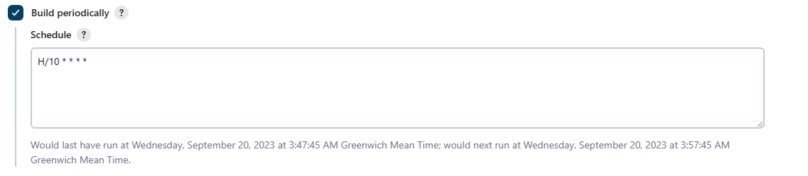
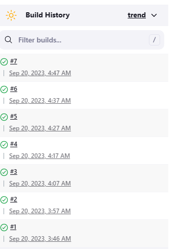
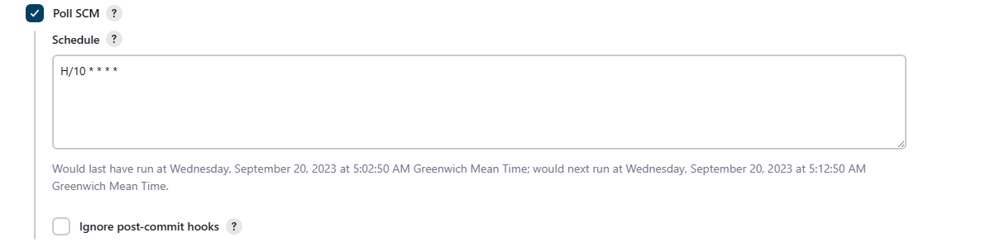
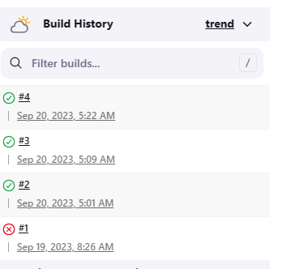
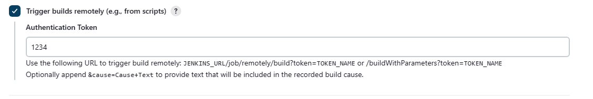

通过触发器，我们可以让 pipeline 按照我们指定的规则进行自动 Build。

<!--more-->
Jenkins 支持六种触发器，分别是：
- Build after other projects are built
- Build periodically
- GitHub hook trigger for GITScm polling
- Poll SCM
- Quiet period
- Trigger builds remotely (e.g., from scripts)

Build after other projects are built：在指定的 Project 后面构建。并支持以下四种情况：
- Trigger only if build is stable：只有在指定的 Project 在 stable 的情况下才会触发
- Trigger even if the build is unstable：指定的 Project 在 unstable 的情况下也会触发
- Trigger even if the build fails：指定的 Project 在 fail 的情况下也会触发
- Always trigger, even if the build is aborted：总是触发，即使指定的项目构建被 aborted。

在该示例中，我们指定了一个 kubernetes project，这个 project 具体做了什么，并不重要，只要它是 stable 就行。


然后回到 kubernetes project 进行 build，等待 build 完成，回到这个 project，查看 Build History，会看到一个新的 Build 触发了，点击进去，在 status 页面，你可以看到 “Started by upstream project kubernetes build number 20”。kubernetes 是 project 名，20 是 kubernetes 的 build ID。即当前 build ID 触发了当前项目的 Build。


Build periodically：定时构建。下面示例定义了一个 project，每 10 分钟构建一次。在 Schedule 文本框中，有当前配置的说明，最后一次运行是什么时候，下一次是什么时候（填写好 Schedule，需要点击 Save 保存，这里的下一次运运行的时时间才会显示正确）。


我们还可以设置：
- 每小时 build 一次：H H/1 * * *
- 每天的 8 点，12 点，22 点构建一次：H 8,12,22 * * *
- 每天 22 点构建一次： H 22 * * *

等待一会，吃个饭回来看该项目的 build history，该 project 每 10 分钟就 build 一次。如果你想快点看到效果，可以设置为每分钟。


GitHub hook trigger for GITScm polling：利用 GitHub 的 webhook 实现当新的代码被 push 到仓库的时候，触发构建。关于这部分的内容，我们这里跳过，这里只要知道这个选项是做什么的，后面我们有专门的一篇来讲这个的配置过程。


Poll SCM：定期轮询代码仓库，如果有变化，就触发 Build。Schedule 语法格式与 Build periodically 一样。


然后更改 project 中的仓库中的内容，并 push。等待相应的时间（下一次时间是 5:12，但我们 push 的时间已经过 5:12 了，所以需要等到 5:22）。


Trigger builds remotely (e.g., from scripts)：通过一个 URL 从远程触发 Build。
配置 Authentication Token，然后通过 URL 进行触发 Build。
JENKINS_URL/job/remotely/build?token=<TOKEN\>


创建一个新的 project，并勾选 GitHub hook trigger for GITScm polling。

输入下面内容到 pipeline 脚本文本框，并尝试手动 build。
```bash
pipeline {
    agent any
    stages {
        stage('Pull') {
            steps {
                retry(3) {
                    git branch: 'master', url: 'https://ghproxy.com/https://github.com/Aaron-Yu1/mysite_django.git'
                }
            }
        }
        stage('Test') {
            steps {
                sh 'echo pylint --rcfile=pylint.conf base'
                sh 'echo Unit Testing...'
            }
        }
        stage('Build') {
            steps {
                sh ''' 
                    mkdir django
                    mv $(ls --ignore=django --ignore=nginx_dockerfile --ignore=django_dockerfile) django
                    cd django
                    tar -zcvf Django.tar.gz ./*
                    cp Django.tar.gz ../django_dockerfile
                    cd ../django_dockerfile
                    echo docker build -t django:v1 .
                    cd ../nginx_dockerfile
                    echo docker build -t nginx:v1 .
                '''
            }
        }
    }
    post { 
        cleanup {
            sh '''
                rm -rf ./*
                echo docker builder prune -f
            '''
        }
    }
}
```

Build 成功后，更改 pipeline 脚本内指定的 GitHub 项目的内容，并 push。完成后，返回当前项目，查看 Build 是否再次运行。

