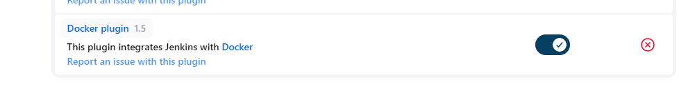
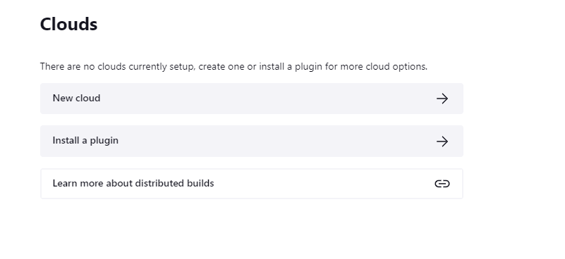
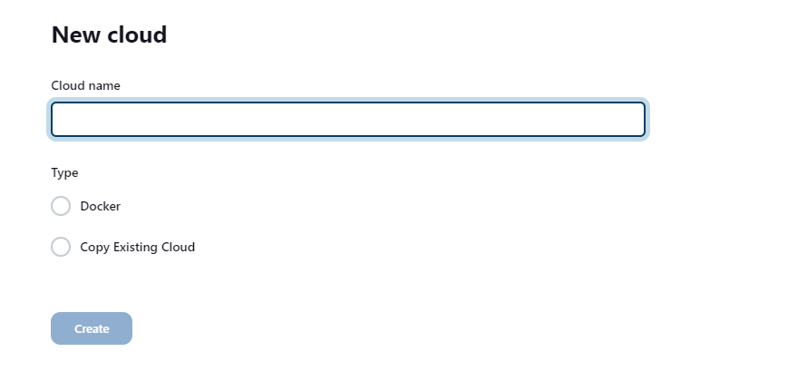
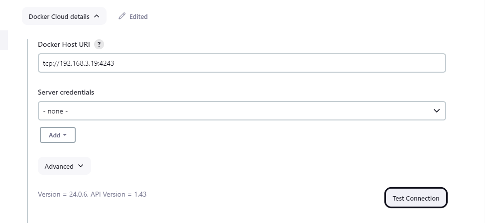
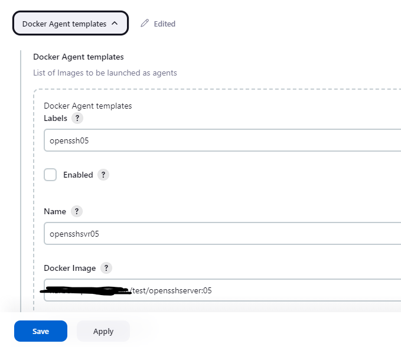
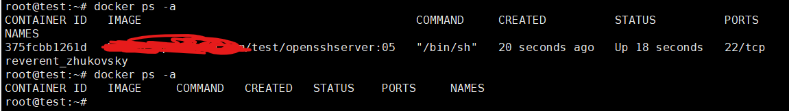
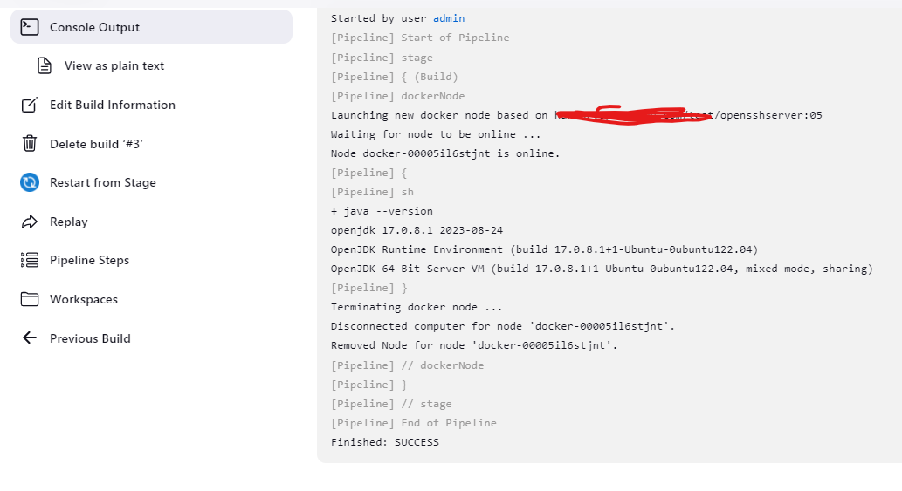

一般情况下，我们会有多个环境，需要不同的配置，甚至涉及到多个主机（集群）的环境。我们应该在一个独立纯净的环境下进行 Build，将 build 环境与本地环境分离。

<!--more-->

在这种情况，我们可以使用 docker container 的方式进行构建。

在这里，我们可以使用之前配置好的节点作为我们的 Docker host，并在上面启用 REST API。

更改 Docker service 文件，在 ExecStart 后面添加 “-H tcp://0.0.0.0:4243”。 
```bash
root@test:~# cat /lib/systemd/system/docker.service 
... ...
ExecStart=/usr/bin/dockerd -H fd:// --containerd=/run/containerd/containerd.sock -H tcp://0.0.0.0:4243
ExecReload=/bin/kill -s HUP $MAINPID
... ...
```

然后重启 docker 服务
```bash
root@test:~# systemctl daemon-reload 
root@test:~# systemctl restart docker.service 
```

测试配置(jq 可能需要额外安装）：
```bash
root@test:~# curl http://localhost:4243/version | jq
  % Total    % Received % Xferd  Average Speed   Time    Time     Time  Current
                                 Dload  Upload   Total   Spent    Left  Speed
100   822  100   822    0     0  21702      0 --:--:-- --:--:-- --:--:-- 22216
{
  "Platform": {
    "Name": "Docker Engine - Community"
  },
  "Components": [
    {
      "Name": "Engine",
      "Version": "24.0.6",
      "Details": {
        "ApiVersion": "1.43",
        "Arch": "amd64",
        "BuildTime": "2023-09-04T12:31:44.000000000+00:00",
        "Experimental": "false",
        "GitCommit": "1a79695",
        "GoVersion": "go1.20.7",
        "KernelVersion": "5.15.0-79-generic",
        "MinAPIVersion": "1.12",
        "Os": "linux"
      }
    },
    ... ...
  ],
  "Version": "24.0.6",
  "ApiVersion": "1.43",
  "MinAPIVersion": "1.12",
  "GitCommit": "1a79695",
  "GoVersion": "go1.20.7",
  "Os": "linux",
  "Arch": "amd64",
  "KernelVersion": "5.15.0-79-generic",
  "BuildTime": "2023-09-04T12:31:44.000000000+00:00"
}
```

使用 docker pipeline，我们需要在 Jenkins 上安装 docker 插件。



点击 Manage Jenkins > Nodes > Clouds. 在 Clouds 页面，点击 New cloud。如果没有 New cloud 选项，你需要点击 Install a plugin，来安装 docker 插件。


在 Cloud name 文本框中，输入节点的名称，并选择 Type 为 Docker。


点开 Docker Cloud details 展开，填写 Docker Host URI 为 “tcp://<Docker IP>:4243”。 然后点击 Test Connection，测试连接。测试完成后，会显示当前 Docker 的版本，以及 API 的版本。


点击 Docker Agent templates 展开，然后点击 Add Docker Template。输入下面信息：
- Labels：该节点的标签，我们可以通过 label 选择该节点
- Name：该节点的名称，输入一个方便识别的名称即可
- DOcker Image：输入作为 docker 容器的镜像。需要注意，Docker 需要安装 Java
- Registry Authentication：如果下载镜像的仓库需要验证，则需要配置该选项
- Remote File System Root：指定一个 目录作为 root 目录
- Connect Method：选择 Attach Docker container 即可
- Pull strategy：镜像的；拉取策略，基于需要选择，一般选择 Pull once and update latest。

然后点击 Save 保存（截图只包含部分内容）


粘贴 pipeline 脚本，并进行 build。
```bash
pipeline {
    agent none
    stages {
        stage('Build') {
            agent {
                dockerContainer { image 'harbor.test.local/test/opensshserver:05' }
            }
            steps {
                sh 'java --version'
            }
        }
    }
}
```

在 build 过程中，我们可以在 Docker 主机上通过 docker ps 看到，一个 docker 容器被启动了。Build 完成后，容器将自己停止并被删除。

