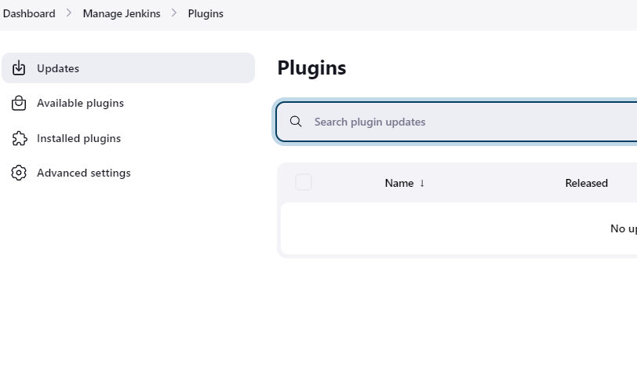
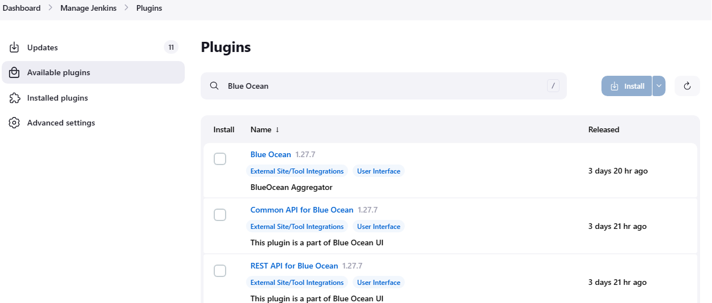
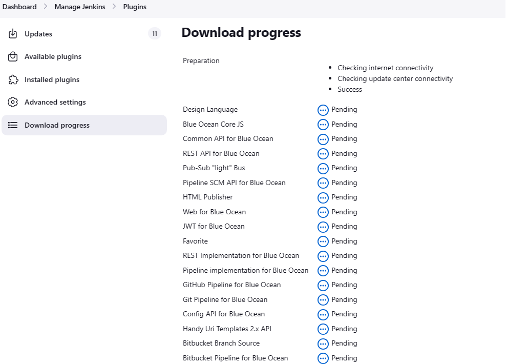
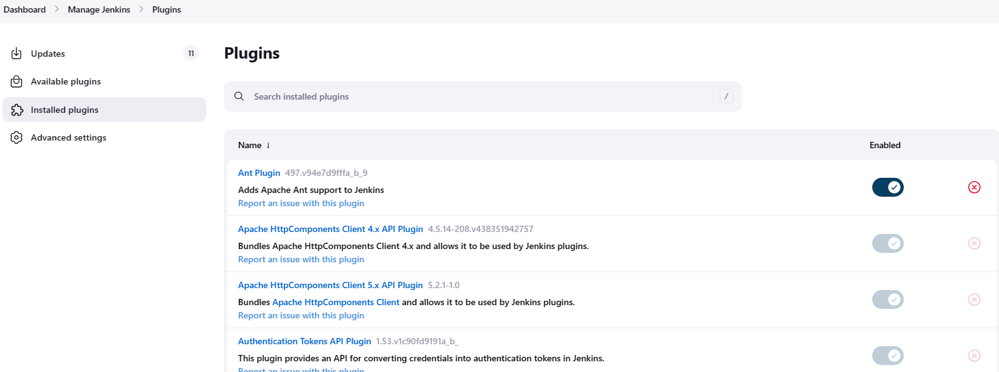
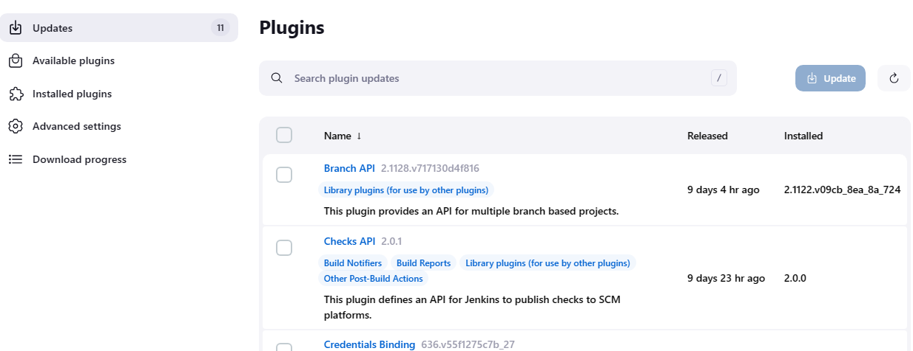

Jenkins 有丰富的插件功能，今天我们就来看一看，Jenkins 中，插件相关的内容。

<!--more-->

登录到 Jenkins，现在 Mange Jenkins > Plugins。在左边，我们可以选择：
- Updates：用于更新已经安装的插件
- Available Plugins：当前可用的插件
- Installed Plugins：已经安装的插件
- Advanced settings：Jenkins 中关于插件的一些设置选项

首先，我们来看一看怎么在 Jenkins 中安装插件。

选择 Available Plugins 选项，可用在右边看到一个按序排列的插件列表，我们可以在这里面选择我们需要安装的插件，也可以在 Plugins 下面的文本框中，输入想要安装的插件，进行搜索。我们以 Blue Ocean 插件为例。
找到该插件，并点击该插件名，将会打开该插件的 Documentation 页面。勾选该插件，然后点击 Install 进行安装。

正在下载并安装插件。

在 Installed Plugins 页面内，我们可以看到所有已经安装好的插件。我们可以通过 Enabled 下面的开关，对插件进行启用或关闭（有些插件是运行 Jenkins 必须的，不能被关闭，也不能卸载。），还可以通过最右边的 “⊗”，卸载插件。

在 Updates 页面，显示了那些插件已经有新版本了，需要更新到新版本，我们可以基于需要，选择我们要更新的插件，并将它们更新到最新版本。勾选需要更新的插件，点击 Update 就可以更新对应的插件了。

在 Advanced settings 页面，我们可以对安装插件时的一些行为做配置：
- HTTP Proxy Configuration：如果是你通过 Proxy 进行上网的，你就需要通过该选项配置你的代理。
- Deploy Plugin：在没有互联网的情况下，我们可以通过能够访问互联网的主机下载插件，然后通过该选项，进行离线安装插件。
- Update Site：插件安装和更新的源地址。

对于某些场景，下载或更新插件经常出现 time out 的情况时，你可以尝试更改 Update site 地址到下面的地址，从第三方指定的源地址中下载插件：
https://mirrors.tuna.tsinghua.edu.cn/jenkins/updates/update-center.json
