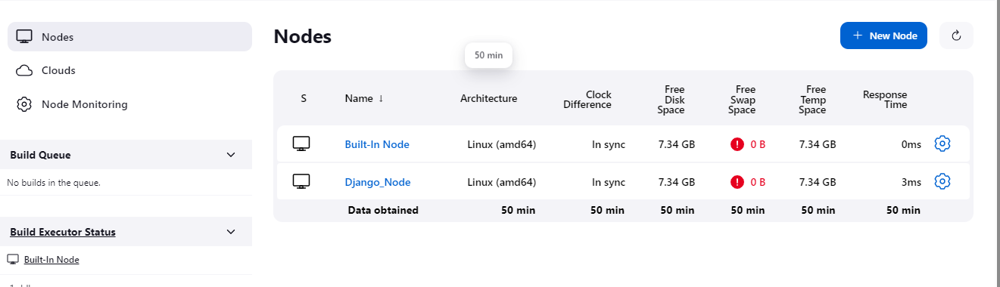
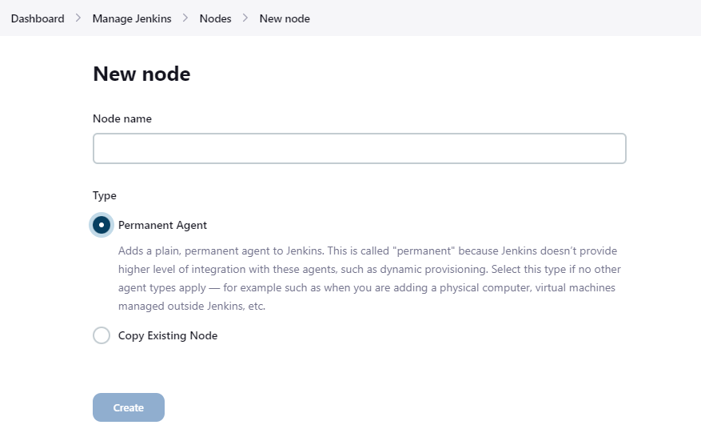
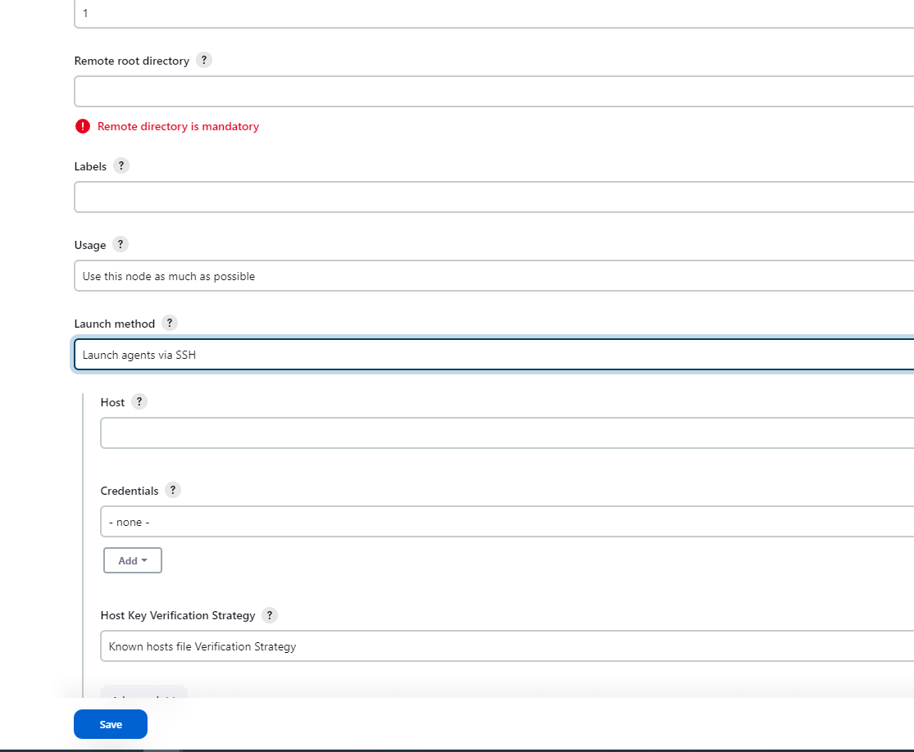

从前面的 pipeline 示例可以看出，正常情况下，我们不会直接在 Jenkins 这台机器上进行 Build 相关操作的，为了满足不同的条件，我们需要不同的环境，所以我们需要专门的机器，来构建我们的 build 环境。

下面我们就来看一下，怎么在 Jenkins 中添加一个节点，将这节点作为 build 主机，在该主机上进行 build。


准备一台虚拟机，作为 Django 的 build 节点，并配置：
- 安装 Java
- 安装 python3-pip（可选，基于 build 的代码决定）
- 通过 pip 安装 Django, pylint, pylint-django
- 安装 docker（我们这里是通过 docker build Django container 的）

环境准备好后，我们就可以添加节点了，我们这里使用的是 ssh 的方式，所以，在添加节点之前，你需要配置好相关凭据。关于凭据，可以参考前面关于凭据的内容。

登录到 Jenkins，点击 Manage Jenkins > Nodes。


点击右边的 New Node 按钮，添加新的 Node。


在 Node name 文本框中，输入节点的名称，并选择 Type，如果是第一次添加节点，则只有一个 Permanent Agent 选项。


填写下面信息
- Remote root directory：远程节点的根目录，可以使用现有目录，也可以创建一个新的目录
- Labels：为节点定义一个标签，以便我们在 pipeline 中通过标签选择节点。
- Launch method：选择 Launch agents via SSH.
    - Host：远程主机的地址，如果是主机名，确保可以正常解析
    - Credentials：选择对应的凭据

其他信息，可以根据需要填写。

填写完成后，点击 Save 保存。然后我们就可以在 Nodes 页面就可以看到你添加的 Node 了。点击对应的 node，可以通过左边的 Log 选项，查看对应的 log，如果出现 “Agent successfully connected and online”，则表示添加成功。

修改我们前面的 pipeline，更改 agent。
```bash
pipeline {
    agent { label 'django' }
    stages {
        stage('Pull') {
            steps {
                retry(3) {
                    git branch: 'master', url: 'https://ghproxy.com/https://github.com/Aaron-Yu1/mysite_django.git'
                }
            }
        }
        stage('Test') {
            steps {
                sh 'pylint --rcfile=pylint.conf base'
                sh 'echo Unit Testing...'
            }
        }
        stage('Build') {
            steps {
                sh ''' 
                    mkdir django
                    mv $(ls --ignore=django --ignore=nginx_dockerfile --ignore=django_dockerfile) django
                    cd django
                    tar -zcvf Django.tar.gz ./*
                    cp Django.tar.gz ../django_dockerfile
                    cd ../django_dockerfile
                    docker build -t django:v1 .
                    cd ../nginx_dockerfile
                    docker build -t nginx:v1 .
                '''
            }
        }
    }
    post { 
        cleanup { 
            sh '''
                rm -rf ./*
                docker builder prune -f
            '''
        }
    }
}
```