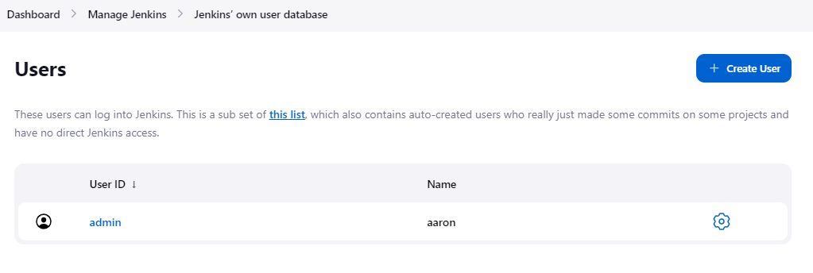
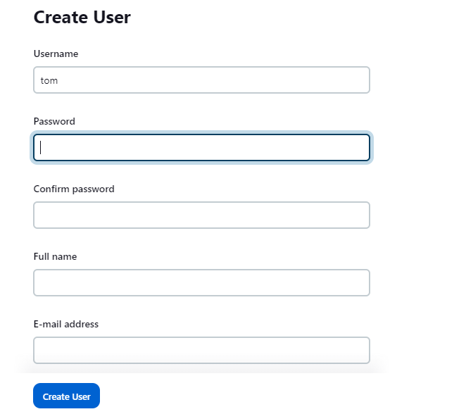

今天我们来看一看，Jenkins 中的用户管理。

<!--more-->

### 创建用户
登录到 jenkins, 并导航到 Manage Jenkins > Users. 然后点击 Create User 按钮，创建 User。

输入用户信息：
- Username
- Password
- Confirm password
- Full name
- E-mail address
然后点击 Create User 按钮，创建用户。

### 删除用户
在 Users 页面，找到想要删除的用户，点击有点的删除（垃圾桶）图标，删除改用户。在弹出的确认窗口，点击 OK 就可以了。

