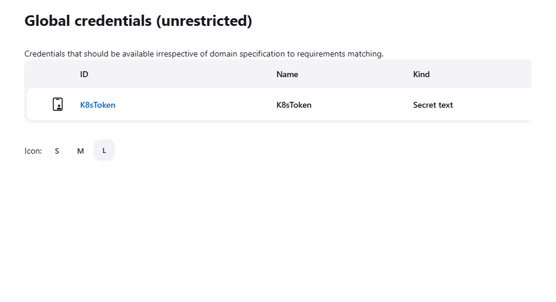
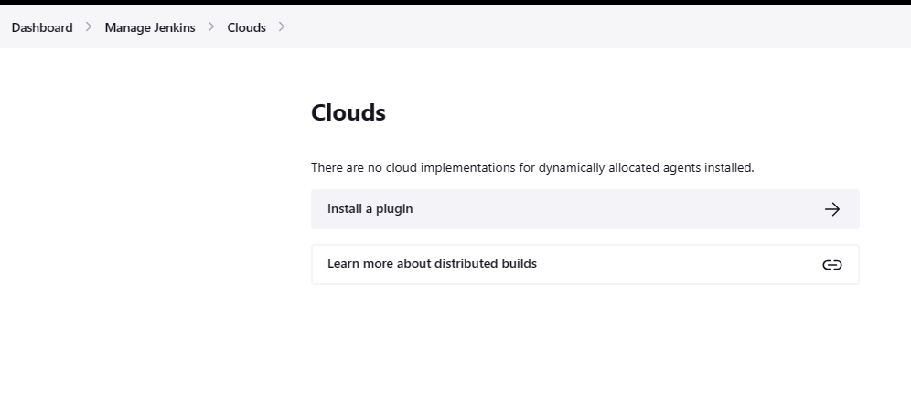
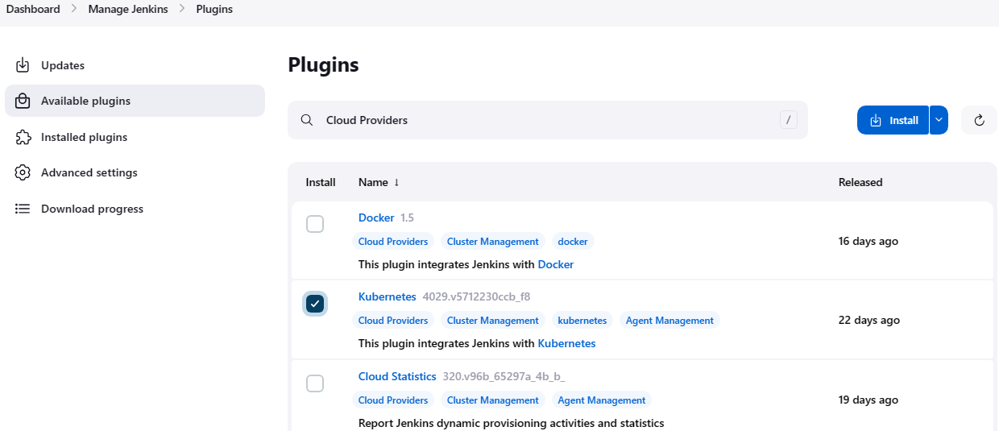
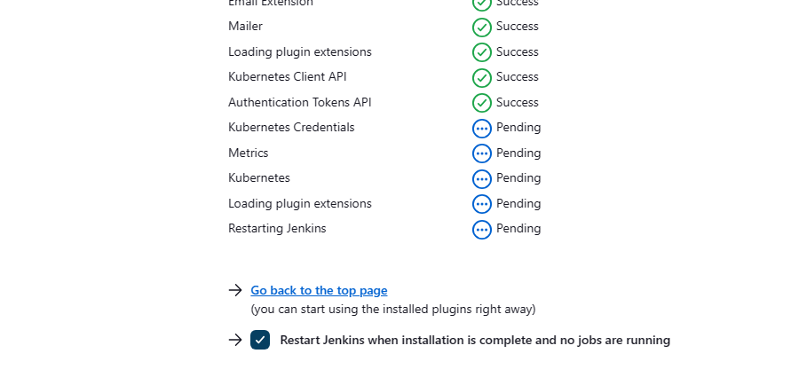
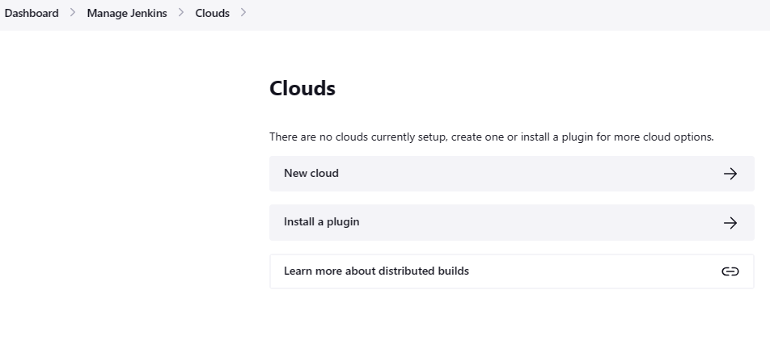
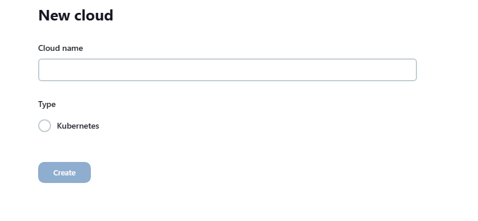
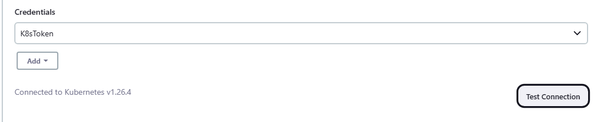
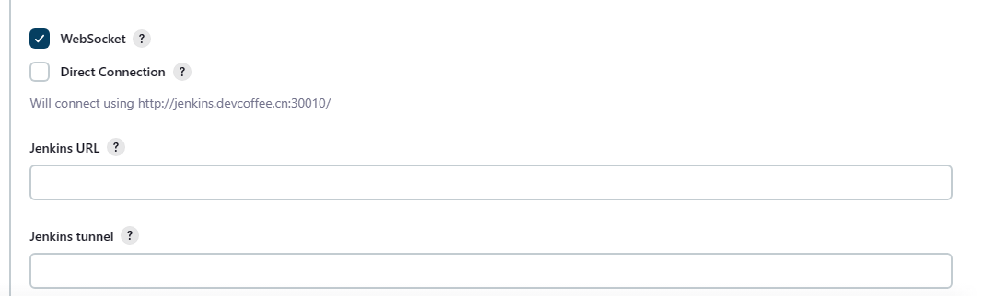
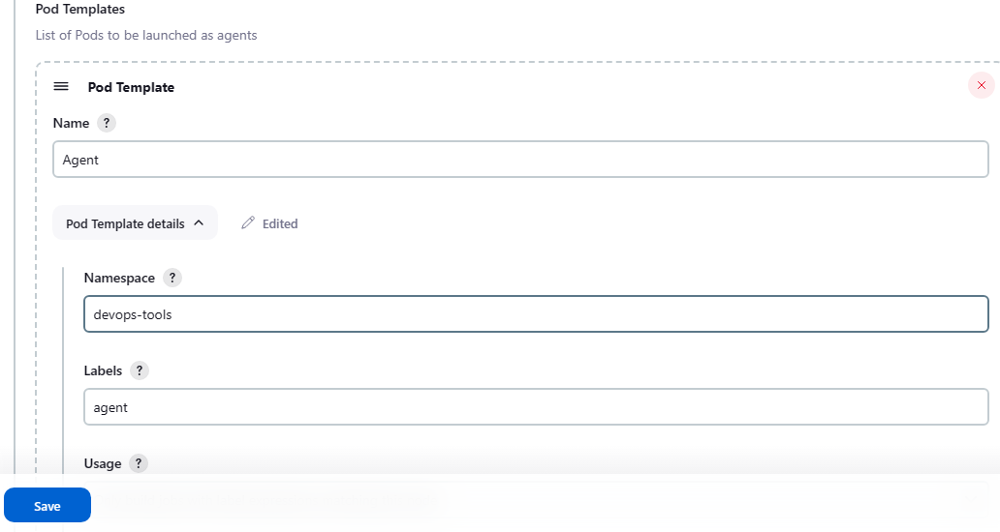
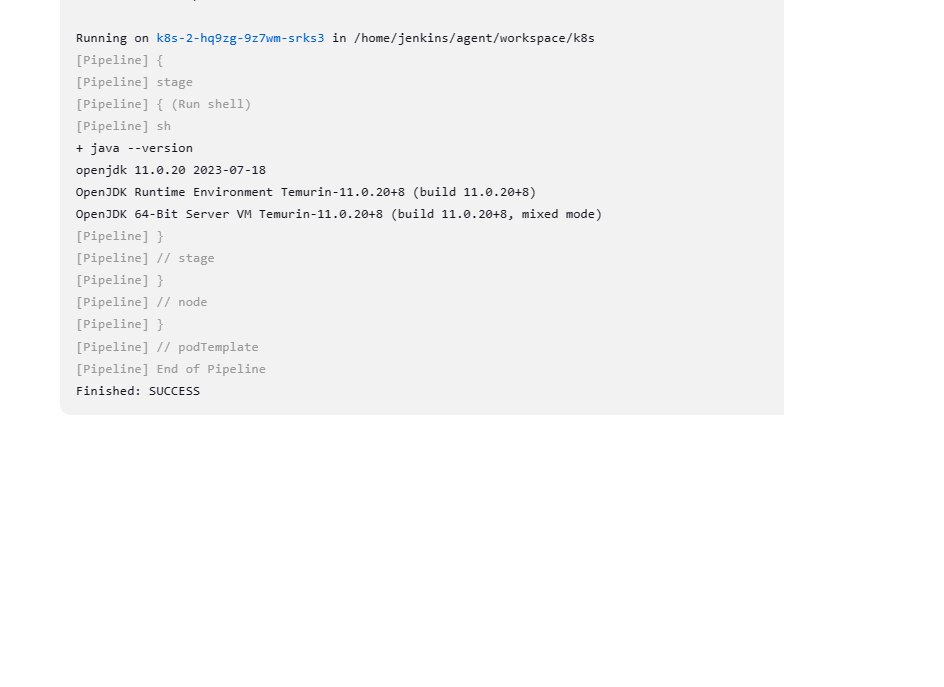

前面，我们已经演示了，如何添加 docker 节点，今天我们来看看，如何添加 kubernetes 环境中到我们的 Jenkins 环境。

<!--more-->

为 kubernetes 准备凭据。

凭据可以使用下面命令直接获取系统当前 admin 的 token，也可以单独为 Jenkins 创建一个 token。
```bash
root@master:~# kubectl -n kube-system describe secret $(kubectl -n kube-system get secret | grep kube-admin | awk '{print $1}')
```


登录到 Jenkins，导航到 Manage Jenkins > Nodes > Clouds。如果是第一次添加 Cloud 节点，需要安装插件，点击 Install a Plugin 安装插件。


页面自动跳转到 Available Plugins 页面，勾选 Kubernetes 插件，并点击 Install 按钮，进行插件安装。


等待插件安装完成，并勾选 “Restart Jenkins when installation is complete and no jobs are running”。安装完成后，重启 Jenkins。


返回到 Clouds 页面，点击 New Cloud 创建一个新的 Cloud 节点


在 Name 文本框中，输入节点的名称，如 k8s。选择 Type 为 Kubernetes，然后点击 Create 创建节点。如果你安装了多个 Cloud 插件，则这里会有多个 Type 供你选择。


展开 Kubernetes Cloud details 选项，在 Credentials 框中，选择 kubernetes 的凭据。然后点击右下角的 Test Connection 按钮，测试连接。测试成功后，你会看到连接成功提示，并告诉你当前的 kubernetes 版本。


勾选 WebSocket。
选择 WebSocket，代理将通过 HTTP(S) 而不是 Jenkins 服务的TCP端口进行直接连接。当代理在外部集群中并且 Jenkins 控制器不能直接访问时(例如，它在反向代理或入口资源后面)，选用 WebSockt 可以极大地简化设置。


其他选项保持默认。

展开 Pod Templates，点击 Add Pod Template 按钮，添加一个 Pod 模板。

在 Name 文本框中，输入 Pod 的名称。然后点击 Pod Template details 展开，填写下面信息：
- Namespace：Pod 的 namespace，Jenkins build 时，将在此 namespace 下启动临时 pod。
- Labels：Pod 的标签

在 Containers 下，点击 Add Container 按钮，添加 container 到该 pod。并填写信息：
- Name：Container 的名称
- Docker Image：Container 使用的镜像
- Always pull image：基于需要选择

其他选项，根据需要填写，一般保持默认即可。然后点击 Save 按钮保存。


创建要给新的 Pipeline，并 Build。
```bash
podTemplate {
    node(POD_LABEL) {
        stage('Run shell') {
            sh 'java --version'
        }
    }
}
```

Build 完成后，可以在 Console Output 看到 shell 命令的输出。
