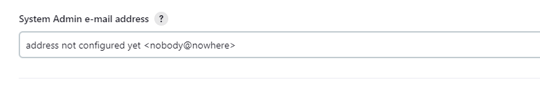
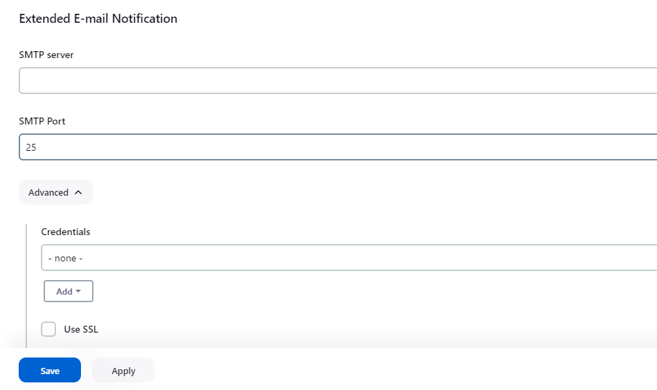
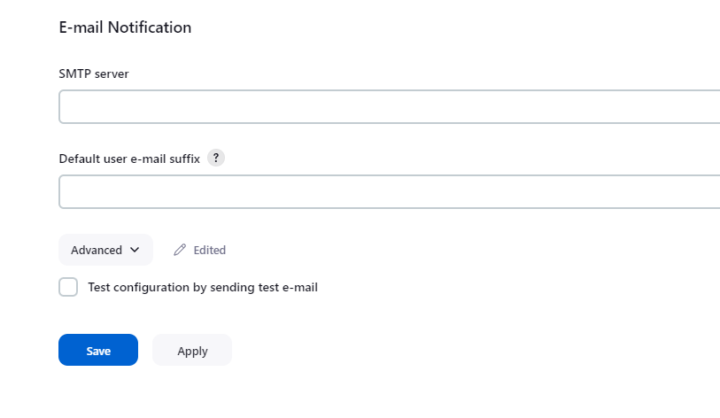
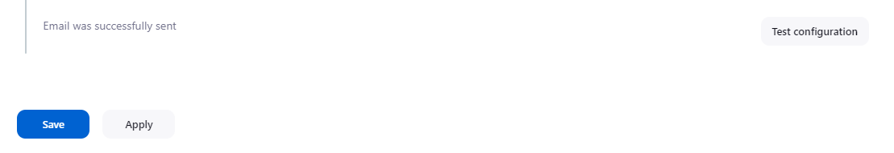

正常情况下，我们的 Build 任务不会很快完成，执行一两个小时是很正常的情况，所以我们需要一个通知机制，告诉我们 build 结果，而不是过一会登录到 Jenkins 看一下结果，过一会登录到 Jenkins 查看一下结果。

<!--more-->

而邮件通知，是一个使用非常普遍的通信机制，今天我们就来看一下 Jenkins 中的邮件通知。

登录到 Jenkins，导航到 Manage Jenkins > System。

在 System Admin e-mail address 下面添加发送邮件的邮箱作为管理员的邮箱地址


在 Extended E-mail Notification，填写：
- SMTP Server：输入你的 SMTP 服务器地址
- SMTP Port：SMTP 服务器对应的端口
- Advanced
    - Credentials：添加你发送邮件的邮箱的凭据（邮箱和密码）
        - 可以使用现有凭据，也可以通过 Add 按钮添加一个新的凭据
    - Use TLS：如果使用了 TLS，需要勾选，相应的，如果使用 SSL，则需要勾选 Use SSL。
    - Default Content Type：方式邮件正文的类型（text 或 HTML）
    - Default Subject：编辑默认使用的邮件主题，在这里，我们可以使用我们的全局环境变量。
- Default Content：默认邮件正文。同样也支持全局变量。
- Default Triggers：展开，并勾选：
    - Failure-Any
    - Success
    - 如果你想要其他状态也发送邮件，可以勾选对应的触发器


E-mail Notification
- SMTP Server：输入你的 SMTP 服务器地址（与前面配置一致）
- Advance：
    - 勾选 Use SMTP Authentication，并输出用户名密码
        - User Name：邮箱名称（和前面配置的一致）
        - Password：邮箱的密码
    - 勾选 Use TLS，如果使用的是 SSL，就勾选 Use SSL
    - SMTP Port：与前面一致
- 勾选 Test configuration by sending test e-mail，并输入一个用于接收测试邮件的邮箱。然后点击 Test configuration 按钮测试。


当你看到 Email was successfully sent，表示测试已经完成，你可以在你接收测试邮件上看到一封测试邮件。然后点击 Save 保存配置。


到这里，我们邮件的通知相关的配置已经完成了，现在，我们来看一看，怎么在 Pipeline 中使用邮件通知吧。

新建一个 Pipeline，在 pipeline 脚本窗口输入下面内容（该示例中，我们使用的是前面配置的默认主题和邮件正文）：
```bash
pipeline {
    agent any
    stages {
        stage('test') {
            steps {
                sh 'echo Hello World'
            }
        }
    }
    post { 
        always {
            emailext (
                to: '<email address>', 
                subject: '$DEFAULT_SUBJECT',
                body: '$DEFAULT_CONTENT',
                mimeType: 'text/html'
            );
        }
    }
}
```

build 完成后，查看控制台输出。并查看邮件，是否收到通知。