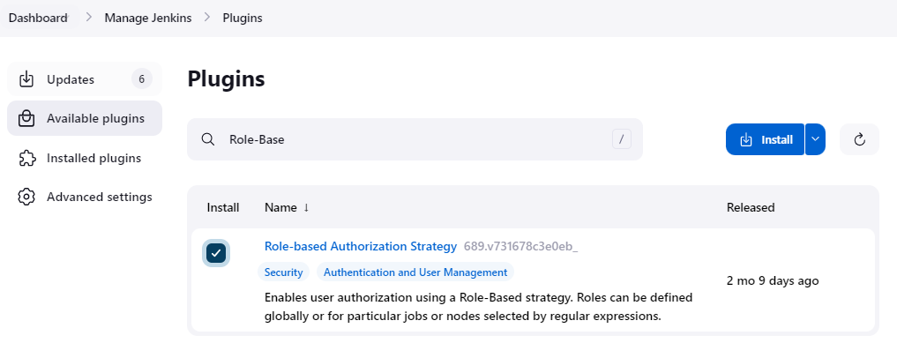
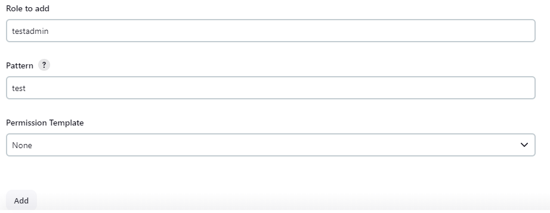
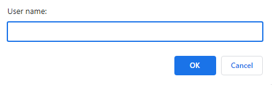

在 Jenkins 中，使用基于角色的用户管理，需要安装 Role-based Authorization Strategy 插件。

<!--more-->

安装插件

登录到 jenkins, 并导航到 Manage Jenkins > Security. 在 Authentication > Authorization 下，下拉选择 ole-based Strategy。然后点击 Save 保存配置。

返回到 Manage Jenkins，然后选择 Manage and Assign Roles。

在该页面中，我们可以：
- Manage Roles：在该页面中，我们可以进行 Role 的管理，如，创建 role，更改 role 的权限等待
- Assign Roles：分配用户到对应的 Role
- Permission Templates: 角色的权限模板
- Role Strategy Macros：角色策略的 Macros 信息

在 Jenkins 的 Manage Roles 中，有三种角色：
- Global roles：包含完整的权限
- Item roles：包含和 Item（project，job）相关的权限
- Agent roles：包含 Credentials，Agent 和 Metrics 相关的权限

我们可通过创建对应的角色，指定该角色拥有相关的权限（部分或所有）。在某些情况下，我们可能需要结合多个 role。如我们想让某些用户只能看到指定的 Item（job）。

首先，我们需要配置一个 Global Role，并授予 Overall 的 Read 权限，不然不能查看 Jenkins 的 Dashboard 页面。

在 Global Roles 下面的 Role to add 文本框中输入 Role 的名称，然后点击 Add 按钮，添加 role。

在新添加的 Role 栏中，勾选 Overall 下面的 Read 权限（就只一个就可以）

在 Item role 下面输入以下信息：
- Role to add：要添加的 Role 名称
- Pattern：item 的匹配模式，我们有一个名为 test 的 item，所以就直接使用这个作为匹配
- Permission Template：权限模板，当前我们没有配置任何权限模板，所以这里直接使用 None

在 Item role 表中，我们看到对应的 role 已经被创建，然后我们可以在表中，给当前角色分配相关的权限。然后点击 Save 按钮保存配置。

然后点击左边的 Assign Roles，进入 Assign Roles 页面。在 Global roles 下面，点击 Add User 按钮添加用户。

在 User name 文本框中输入你需要添加的用户的名称，然后点击 Ok。

添加完用户后，我们就可以在 Global roles 中给用户分配指定的权限（勾选前面创建的 Global role）

以通用的方式，在 Item roles 中添加用户，并分配 role。

添加完成后，使用该用户登录到 Jenks。当前用户只能看到一个 test 的 item（job）。
